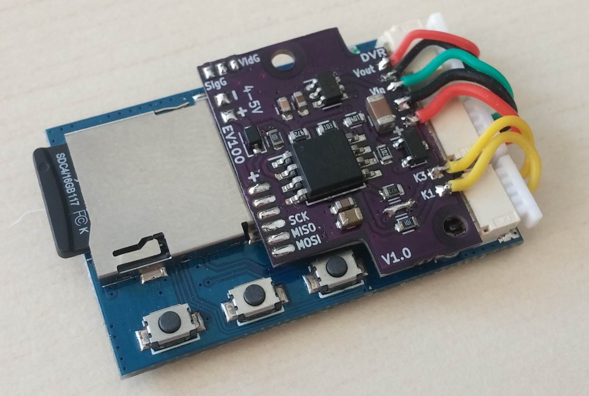

# Control Board for Eachine Pro DVR (to install to EV100 Goggles)

Eachine Pro DVR using different pins for input and output video signal. This makes it difficult to connect to EV100, where only one pin used for playback and recording.

This board helps automate the switching DVR for playback or recording according to EV100 mode.

Also this board delays a startup of DVR for preventing cropping of PAL recording.

There is two additional pads (B0,B2), that can be used for controlling buttons of DVR and/or sensing power loss for preventing loosing last recording (you will need to add a supercapacitor). TODO.

## Current functionality
- When Goggles are powered ON, then power to the DVR is delayed preventing cropping of recorded video (DVR known issue)
- If Goggles is in normal mode (signal is coming from VRX), then DVR is receiving the VRX signal.
- If Goggles in AV mode (signal coming from AVin), then DVR starts to send video own video signal to the Goggles.m

## Can be added with little software modifications
- DVR buttons control: (start recording on power on, switch recording/playback mode)
- Stop recording when Goggles are powered OFF (need to add supercapacitor and short the jumper V_SENSE)
