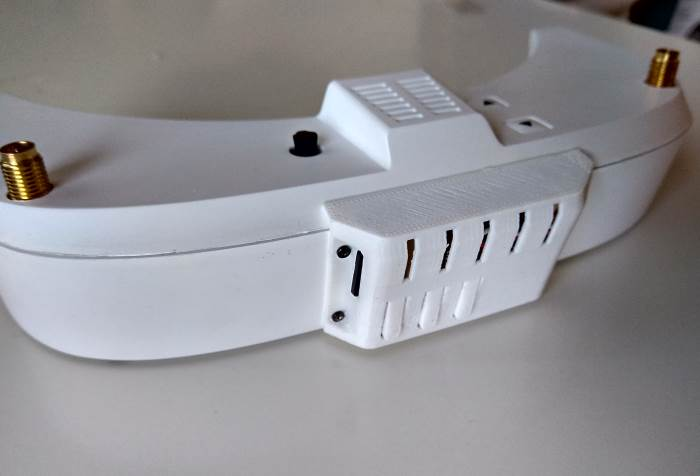
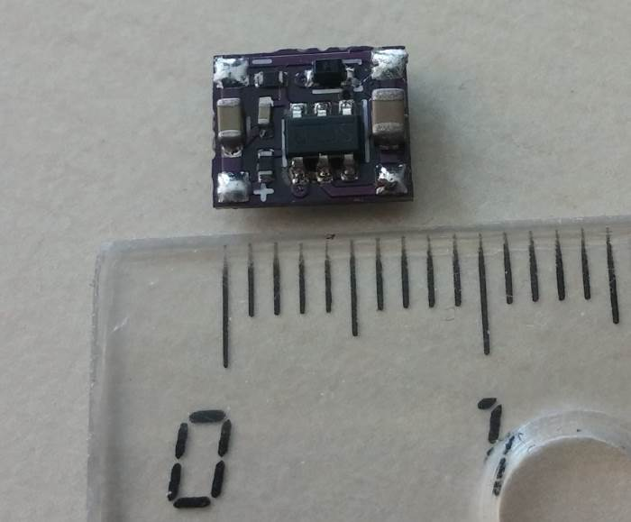

# Control Board for Eachine Pro DVR (to install to EV100 Goggles)

Eachine Pro DVR using separate pins for input and output video signal. This makes it difficult to connect to EV100, where only one pin used for video in and out.

This board helps to automate the switching of video signal in DVR for playback or recording according to EV100 mode.

Also this board delays a startup of DVR for preventing cropping of PAL recording.

There is two additional pads (K1, K3), that can be used for controlling 2 buttons of DVR.

## Current functionality
- When Goggles are powered, power to the DVR is delayed, preventing cropping of recorded video (known as PAL cropping issue).
- If Goggles is in normal mode (signal is coming from VRX), then DVR is receiving the VRX signal.
- If Goggles in AV mode (signal coming from AVin), then DVR starts to send own video to the Goggles.
- Stop recording when Goggles are powered OFF (need to add supercapacitor).
- DVR buttons control: (start recording on power on, switch recording/playback mode automatically).

## Current version of the board

## Installed in the Goggles

## Power
I'm not sure how powerful is Goggle's DC/DC. So, it is safer to power DVR with additional DC/DC directly from Goggles battery.

Currently I'm using DIY 1A DC/DC with 5.2v output. It's switching frequency is 1.6Mhz, and has no noise in recorded video.

## Connection to the Goggles.
TODO.